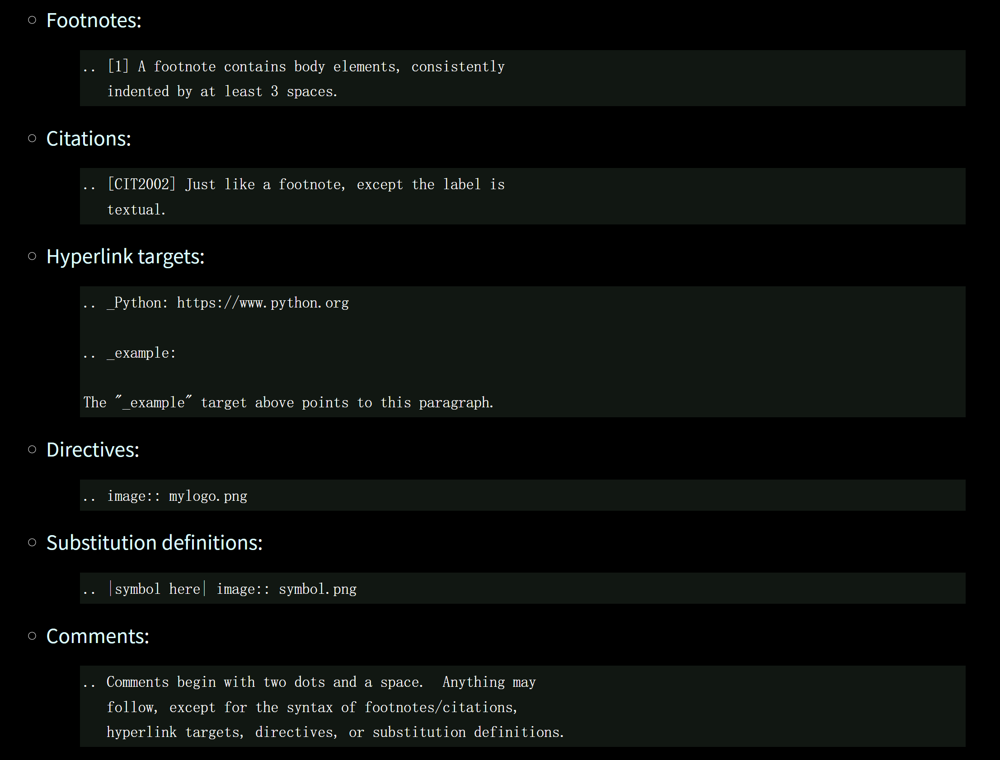

rst语法模板
################

Sections
****************
一、二、三级标题符号： ##########  **********  +++++++

Lists
****************

Bullet Lists
++++++++++++++++

无序列表，使用 - + *

* This is a bulleted list.
* It has two items, the second
    item uses two lines.

+ This is a numbered list.
+ It has two items too.

- This is a numbered list.
- It has two items too.

Enumerated lists
+++++++++++++++++

有序列表，使用 1. 与 #.

1. This is an enumerated list.

2. Enumerators may be arabic numbers, letters, or roman
   numerals

#. is ok

Nested Lists
+++++++++++++++++

- this is
- a list

    - with a nested list
    - and some subitems

- and here the parent list continues

Definition Lists
+++++++++++++++++

term (up to a line of text)
    Definition of the term, which must be indented

    and can even consist of multiple paragraphs

next term
    Description

Field Lists
+++++++++++++++++

:what: what, what

:how: how, how
      how, how

Option Lists
+++++++++++++++++

-a              arabic
-b file         Option-B

--long          Option-Long
--input=file    Option-KV 

Blocks
******************

Literal Blocks
++++++++++++++++++

Literal blocks are either indented or line-prefix-quoted blocks,
and indicated with a double-colon (``::``) at the end of the
preceding paragraph (right here -->)::

    if literal_block:
        text = 'is left as-is'
        spaces_and_linebreaks = 'are preserved'
        markup_processing = None

Quated Blocks
++++++++++++++++++

Block quotes consist of indented body elements:

    This theory, that is mine, is mine.

    -- Anne Elk (Miss)

Doctest Blocks
+++++++++++++++++

>>> print 'Python-specific usage examples; begun with ">>> "'
Python-specific usage examples; begun with ">>> "
>>> print '(cut and pasted from interactive Python sessions)'
(cut and pasted from interactive Python sessions)

Code Blocks
+++++++++++++++++

.. code-block::
   :caption: A cool example

       The output of this line starts with four spaces.

Tables
******************

+------------------------+------------+----------+
| Header row, column 1   | Header 2   | Header 3 |
+========================+============+==========+
| body row 1, column 1   | column 2   | column 3 |
+------------------------+------------+----------+
| body row 2             | Cells may span        |
+------------------------+-----------------------+

Images Ref
******************

image ref :ref:`Link title <my-image>`

.. _my-image:

Link
*****************

This is a paragraph that contains `a link`_, 
.. _a link: https://domain.invalid/

